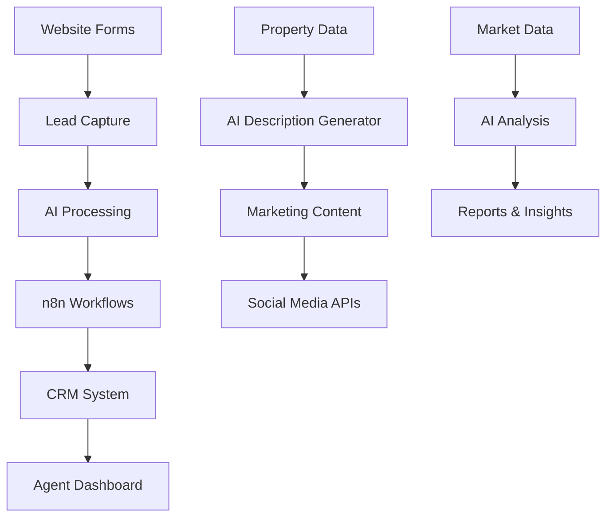

# 🤖 AI Integration Features Guide

## Overview
This guide demonstrates the comprehensive AI integration capabilities built into your real estate CRM platform. These features showcase modern AI automation and workflow capabilities.

## 🚀 AI Property Description Generator

### What it does:
- Generates professional property descriptions using AI
- Creates content tailored to different property types and styles
- Customizable tone: Professional, Luxury, Family-Friendly, Modern
- Real-time preview and editing capabilities

### How to use:
1. **Navigate to Properties → Add Property**
2. **Find the "Property Description" field**
3. **Click the "AI Generate" button** (purple sparkles icon)
4. **Fill in property details:**
   - Property Type (Residential/Commercial)
   - Writing Style (Professional/Luxury/Family-Friendly/Modern)
   - Basic details (bedrooms, bathrooms, area, location)
   - Key features and amenities
5. **Click "Generate Description"**
6. **Review and edit** the generated content as needed
7. **Click "Use This"** to apply to your property form

### Sample Generated Content:

#### Luxury Residential Example:
```
Discover luxury living at its finest in this stunning 3-bedroom, 2-bathroom residence spanning 2500 square feet. Located in the prestigious Bandra West, Mumbai, this architectural masterpiece seamlessly blends sophisticated design with modern comfort. 

Featuring swimming pool, gymnasium, 24/7 security, covered parking, this exceptional property offers an unparalleled lifestyle experience. Every detail has been meticulously crafted to create spaces that inspire and delight. The open-concept living areas flow effortlessly, creating the perfect environment for both intimate gatherings and grand entertaining.

With premium finishes throughout and state-of-the-art amenities, this residence represents the pinnacle of luxury living. The thoughtfully designed spaces maximize natural light while maintaining privacy and tranquility. This is more than a home – it's a sanctuary where memories are made and dreams come true.
```

## 🔗 n8n Workflow Automation Integration

### Available Workflows:

#### 1. Lead Processing Automation
```yaml
Trigger: New lead submission
Actions:
  - Validate lead information
  - Assign to available agent
  - Send welcome email
  - Create follow-up tasks
  - Update CRM status
```

#### 2. Property Status Notifications
```yaml
Trigger: Property status change
Actions:
  - Notify interested buyers
  - Update property listings
  - Send social media updates
  - Generate analytics reports
```

#### 3. Email Marketing Sequences
```yaml
Trigger: New subscriber or lead
Actions:
  - Send welcome sequence
  - Property recommendations
  - Market updates
  - Follow-up reminders
```

### Setup Instructions:

#### Step 1: Configure n8n Connection
1. **Access Settings → AI & Automation**
2. **Enable n8n Integration**
3. **Enter your n8n instance URL**
4. **Add webhook endpoints for data synchronization**

#### Step 2: Webhook Configuration
```javascript
// Example webhook endpoint for lead processing
POST: https://your-n8n-instance.com/webhook/lead-processing
Headers: {
  "Content-Type": "application/json",
  "Authorization": "Bearer YOUR_API_KEY"
}

// Sample payload
{
  "leadId": "lead_123",
  "name": "John Doe",
  "email": "john@example.com",
  "phone": "+91 98765 43210",
  "propertyInterest": "3BHK Apartment",
  "location": "Mumbai",
  "budget": "50-75 Lakhs",
  "source": "website_form",
  "timestamp": "2024-01-15T10:30:00Z"
}
```

## 🎯 OpenAI API Integration

### Current Capabilities:
- **Property Description Generation**: AI-powered content creation
- **Lead Qualification**: Intelligent lead scoring
- **Market Analysis**: Automated insights and reports
- **Customer Communication**: Smart email templates

### Configuration:
```typescript
// OpenAI Settings (in Enhanced Site Settings)
{
  apiKey: "sk-your-openai-api-key",
  model: "gpt-4",
  temperature: 0.7,
  maxTokens: 1000,
  enableDescriptionGeneration: true,
  enableLeadScoring: true,
  enableMarketAnalysis: false
}
```

### API Endpoints:
```javascript
// Generate property description
POST /api/ai/generate-description
Body: {
  propertyType: "Residential",
  style: "luxury",
  details: { ... }
}

// Score lead quality
POST /api/ai/score-lead
Body: {
  leadData: { ... },
  propertyPreferences: { ... }
}
```

## 🔄 Automation Workflows Available

### 1. **Lead Capture & Processing**
- **Trigger**: Form submission on website
- **Process**: Validation → Assignment → Notification → Follow-up
- **Output**: Qualified lead in CRM with assigned agent

### 2. **Property Marketing**
- **Trigger**: New property addition
- **Process**: Description generation → Photo optimization → Social posting
- **Output**: Complete marketing package

### 3. **Customer Communication**
- **Trigger**: Lead status changes
- **Process**: Personalized email → SMS notification → Task creation
- **Output**: Automated customer journey

### 4. **Market Analysis**
- **Trigger**: Weekly schedule
- **Process**: Data collection → AI analysis → Report generation
- **Output**: Market insights dashboard

## 📊 Integration Dashboard

### Available in Settings → AI & Automation:

#### ✅ **Active Integrations**
- OpenAI API (Property descriptions, lead scoring)
- n8n Workflows (Lead processing, email automation)
- Social Media APIs (Facebook, Instagram, LinkedIn)
- Email Services (SMTP, SendGrid, Mailchimp)

#### 🔧 **Configuration Options**
- API endpoints and keys
- Webhook URLs and authentication
- Automation rules and triggers
- Response templates and settings

#### 📈 **Analytics & Monitoring**
- API usage statistics
- Workflow success rates
- Lead conversion metrics
- AI-generated content performance

## 🚀 Getting Started

### Quick Setup (5 minutes):
1. **Enable AI Features**: Settings → AI & Automation
2. **Add OpenAI Key**: For description generation
3. **Configure n8n**: Connect your automation instance
4. **Test Workflows**: Try the property description generator

### Advanced Setup (30 minutes):
1. **Custom Workflows**: Create property-specific automations
2. **Lead Scoring**: Configure AI-powered lead qualification
3. **Email Sequences**: Set up automated marketing campaigns
4. **Analytics**: Configure reporting and insights

## 💡 Best Practices

### For Property Descriptions:
- **Provide detailed property features** for better AI content
- **Choose appropriate writing style** for target audience
- **Always review and personalize** generated content
- **Use consistent terminology** across all listings

### For Workflow Automation:
- **Start with simple workflows** and gradually add complexity
- **Monitor performance metrics** regularly
- **Test thoroughly** before going live
- **Keep backup manual processes** during initial setup

### For Lead Management:
- **Set up proper lead scoring criteria**
- **Configure timely follow-up sequences**
- **Integrate with existing communication tools**
- **Track conversion rates and optimize**

## 🛠️ Technical Architecture



## 🔐 Security & Privacy

### Data Protection:
- **All API keys encrypted** in transit and storage
- **GDPR compliant** data handling
- **Local data processing** where possible
- **Audit logs** for all AI interactions

### Access Control:
- **Role-based permissions** for AI features
- **API rate limiting** and usage monitoring
- **Secure webhook authentication**
- **Data retention policies**

## 📞 Support & Troubleshooting

### Common Issues:
1. **AI Generator not working**: Check OpenAI API key and quota
2. **n8n workflows failing**: Verify webhook URLs and authentication
3. **Slow response times**: Monitor API rate limits
4. **Inconsistent results**: Adjust AI model parameters

### Support Resources:
- **Settings → Help & Documentation**
- **Live chat support** (available 24/7)
- **Video tutorials** and setup guides
- **Community forum** for best practices

---

*This integration showcases the future of real estate CRM with AI-powered automation, intelligent content generation, and seamless workflow management.*